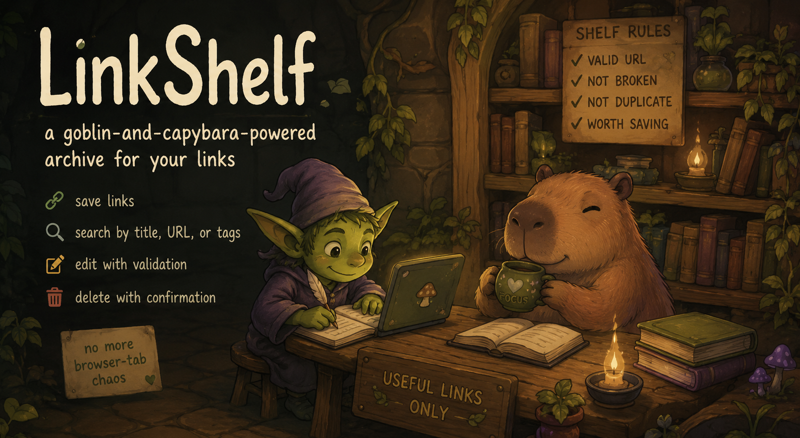
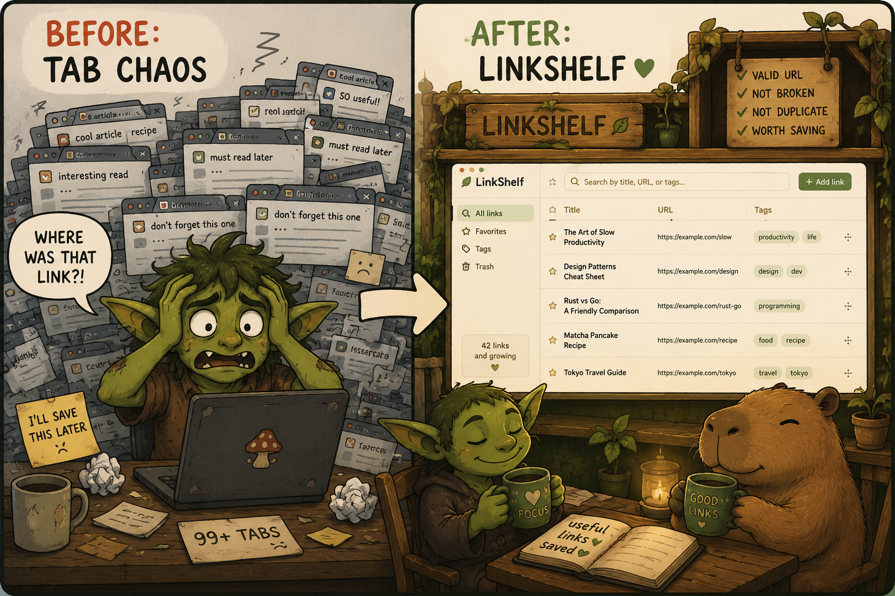
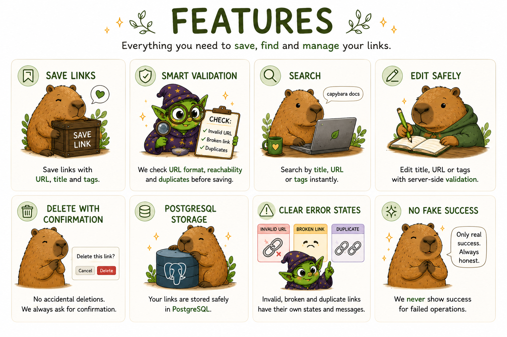
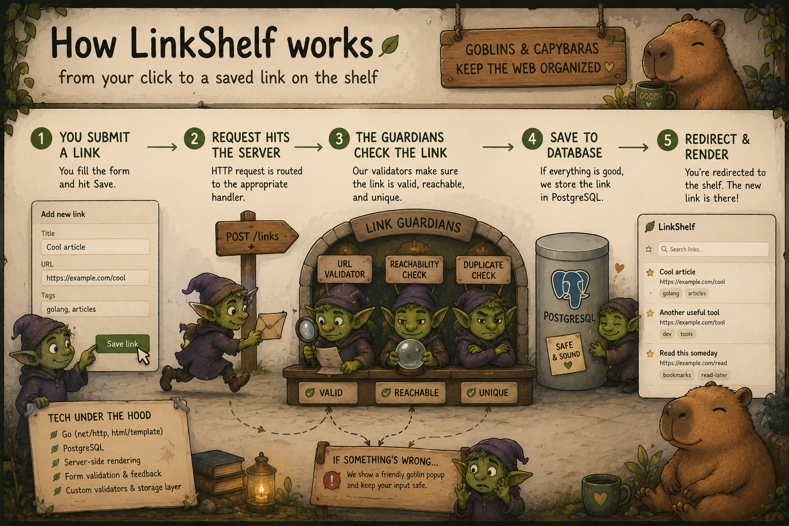
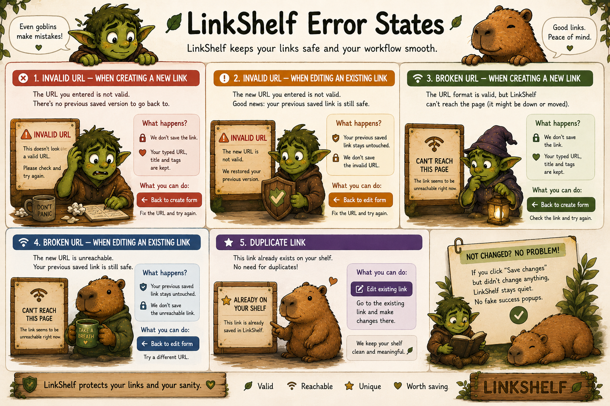
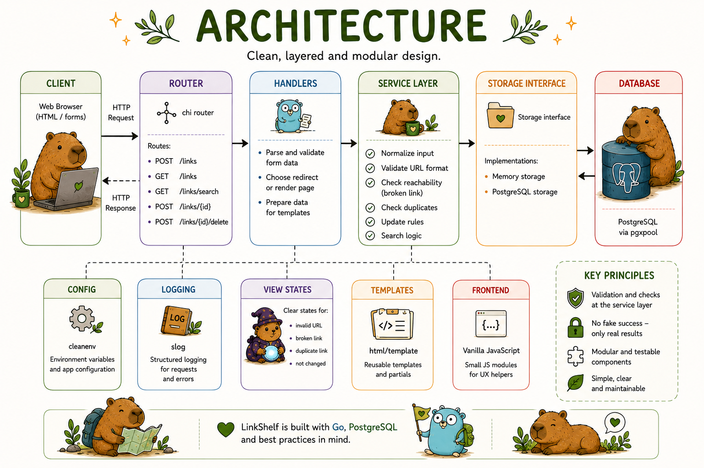
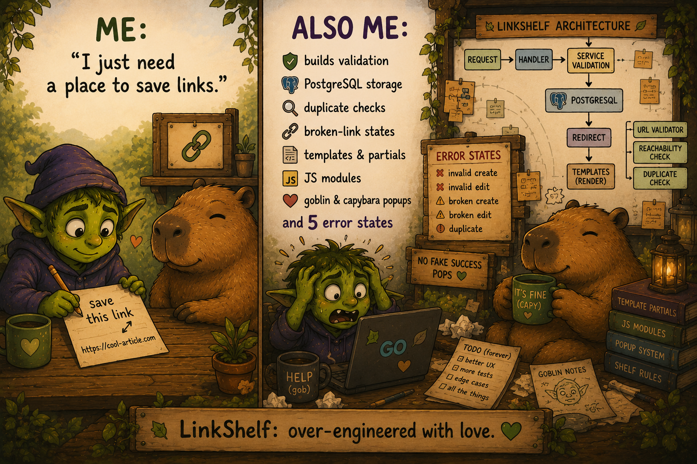

# 🗄️ LinkShelf

> A cozy digital shelf for links that should not disappear into browser-tab chaos.



**LinkShelf** is a small server-rendered web application for saving, searching, editing, and deleting useful links before they vanish into tab chaos.

I built it to practice the lifecycle of a web application: from form submission and HTTP request handling to URL validation, duplicate detection, PostgreSQL storage, redirects, template rendering, and UI feedback.

It is not just a CRUD app - every link has to pass the shelf guardians: URL validation, reachability check, duplicate check, and update-state logic.

---

## 🧌 Why does this exist?

Because useful links have a dangerous habit of disappearing into:

- 47 open browser tabs;
- Telegram Saved Messages full of links I promised to read later;
- bookmarks with no context;
- notes named `read later`;
- and the eternal void of “I will definitely remember where I saved it”.

So I built **LinkShelf** - a tiny archive guarded by goblins and capybaras, where useful links can live peacefully on a digital shelf.



---

## ✨ Features

- Save useful links with URL, title, and tags.
- Search links by **title**, **URL**, or **tags**.
- Edit saved links with server-side validation.
- Delete links with confirmation.
- Store links in PostgreSQL.
- Switch storage implementation through a storage interface.
- Validate URLs before saving.
- Detect duplicate links.
- Detect broken or unreachable links.
- Keep user input when an error happens.
- Show different UI states for create/edit errors.
- Avoid fake success messages when no real changes were made.



---

## 🧭 Application flow

The main goal of the project was to understand how data travels through a small server-rendered web application.

```text
browser form
    ↓
HTTP request
    ↓
handler
    ↓
service validation
    ↓
storage / PostgreSQL
    ↓
redirect
    ↓
template rendering
    ↓
UI state
```



For example, when a user adds a link:

```text
POST /links
    ↓
parse form data
    ↓
normalize URL, title, and tags
    ↓
validate URL format
    ↓
check if the link is reachable
    ↓
check duplicates
    ↓
save to storage or return an error state
```

---

## 🧨 Error states

LinkShelf does not just say “something went wrong”.  
It tries to return the user to the right place with the right data.

| State            | What it means                                                         |
|------------------|-----------------------------------------------------------------------|
| `invalid-create` | The user tried to create a new link with an invalid URL.              |
| `broken-create`  | The URL format is valid, but the link is unreachable during creation. |
| `invalid-edit`   | The user edited an existing link and entered an invalid URL.          |
| `broken-edit`    | The user edited an existing link and the new URL is unreachable.      |
| `duplicate`      | The link already exists on the shelf.                                 |
| `not changed`    | The user clicked Save without changing URL, title, or tags.           |



---

## 🧱 Architecture

The project follows a simple layered structure:

```text
handler → service → storage
```

- **Handlers** receive HTTP requests, parse forms, and choose redirects or templates.
- **Service layer** contains business logic: validation, duplicate checks, reachability checks, and update rules.
- **Storage layer** hides the actual storage implementation behind an interface.

```text
internal/
├── config/          # application configuration
├── domain/          # core domain models
├── http-server/     # handlers, redirects, view states
├── service/         # business logic
└── storage/         # memory and PostgreSQL storage
```



---

## 🛠️ Tech stack

- **Go**
- **PostgreSQL**
- **pgxpool**
- **HTML templates**
- **CSS**
- **JavaScript modules**
- **Docker / Docker Compose**
- **slog** for logging

---

## 🚀 Running locally

The project has a `Makefile` with common development commands.

Show all available commands:

```bash
make help
```

Start the full local development environment:

```bash
make dev
```

This command starts Docker infrastructure first and then runs the Go server:

```text
make dev
  ├─ make docker-up
  └─ make run
```

Open the app:

```text
http://localhost:8081
```

Stop the server with `Ctrl+C` or the Stop button in your IDE.

Stop Docker infrastructure when you finish working:

```bash
make docker-down
```

You can also run commands separately:

```bash
make docker-up
make run
```

Useful development checks:

```bash
make fmt
make vet
make test
make check
```

---

## 🔍 What I practiced

While building LinkShelf, I practiced:

- handling HTTP requests and form submissions;
- working with redirects and query parameters;
- rendering server-side HTML templates;
- splitting large templates into partials;
- validating user input on the server;
- checking links for invalid, broken, and duplicate states;
- designing service-layer errors for UI states;
- working with PostgreSQL storage;
- separating business logic from HTTP handlers;
- using JavaScript modules for small UI flows;
- thinking through user scenarios instead of only implementing CRUD operations.

---

## 🎬 Demo

<!-- TODO: add screen recording -->
<!--  -->

The demo will show the main user flow:

```text
create link
  ↓
validate URL
  ↓
handle duplicate / broken states
  ↓
search saved links
  ↓
edit link
  ↓
delete with confirmation
```

---

## 🧩 Planned improvements

- Add a short screen recording demo.
- Add service-layer tests for validation, duplicate checks, broken-link handling, update rules, and search.
- Add HTTP handler tests for create, update, delete, and search flows.
- Improve structured logging around key user actions and error states.

---

## 🐹 Final mood

> Me: “I just need a place to save links.”  
> Also me: builds validation, PostgreSQL storage, template partials, JS modules, duplicate handling, broken-link states, and goblin-and-capybara popups.


